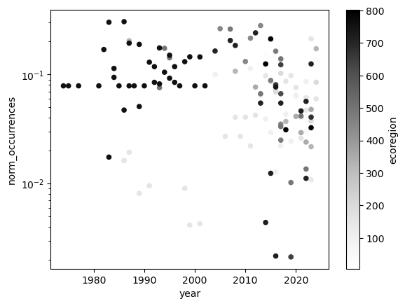

# Access locations and times of Siberian Crane encounters

For this challenge, you the
[Global Biodiversity Information Facility (GBIF)](https://www.gbif.org/).
GBIF is compiled from species observation data all over the world, and
includes everything from museum specimens to photos taken by citizen
scientists in their backyards.

### Set up your code to prepare for download

We need a package called
`pygbif` to access the data, which may not be included in your
environment. 

Import packages that will help you:

- Work with reproducible file paths
- Work with tabular data

```{python}
import time
import zipfile
from getpass import getpass
from glob import glob

import os
import pathlib

from getpass import getpass
from glob import glob

import geopandas as gpd
import pandas as pd

import pygbif.occurrences as occ
import pygbif.species as species

# get month names
import calendar

# libraries for Dynamic mapping
import geoviews as gv
import hvplot.pandas
import cartopy
import cartopy.crs as ccrs
import panel as pn
pn.extension()
```

Create data directory in the home folder

```{python}
data_dir = os.path.join(
    # Home directory
    pathlib.Path.home(),
    # Earth analytics data directory
    'earth-analytics',
    'data',
    # Project directory
    'species',
)
os.makedirs(data_dir, exist_ok=True)

# Define the directory name for GBIF data
gbif_dir = os.path.join(data_dir, 'gbif_siberian')
gbif_dir
```

```
'/home/jovyan/earth-analytics/data/species/gbif_siberian'
```

### Register and log in to GBIF

You will need a [GBIF account](https://www.gbif.org/) to complete this
challenge. You can use your GitHub account to authenticate with GBIF.
Then, run the following code to save your credentials on your computer.

```{python}
reset_credentials = False
# GBIF needs a username, password, and email
credentials = dict(
    GBIF_USER=(input, 'username'),
    GBIF_PWD=(getpass, 'password'),
    GBIF_EMAIL=(input, 'email'),
)
for env_variable, (prompt_func, prompt_text) in credentials.items():
    # Delete credential from environment if requested
    if reset_credentials and (env_variable in os.environ):
        os.environ.pop(env_variable)
    # Ask for credential and save to environment
    if not env_variable in os.environ:
        os.environ[env_variable] = prompt_func(prompt_text)
```

### Get the species key

```{python}
# Query species
species_info = species.name_lookup('grus leucogeranus', rank='SPECIES')

# Get the first result
first_result = species_info['results'][0]

# Get the species key (nubKey)
species_key = first_result['nubKey']

# Check the result
first_result['species'], species_key
```

```
    ('Grus leucogeranus', 2474961)
```

### Download data from GBIF

This gets _all_ data for Siberian Crane, since it is rare and endangered.
Thus the `year` variable is dropped. Note that we can check progress at
<https://www.gbif.org/user/download>.

```{python}
# Only download once
gbif_pattern = os.path.join(gbif_dir, '*.csv')
if not glob(gbif_pattern):
    # Only submit one request
    if not 'GBIF_DOWNLOAD_KEY' in os.environ:
        # Submit query to GBIF
        gbif_query = occ.download([
            "speciesKey = " + str(species_key),
            "hasCoordinate = TRUE",
            #"year = 2023",
        ])
        os.environ['GBIF_DOWNLOAD_KEY'] = gbif_query[0]

    # Wait for the download to build
    download_key = os.environ['GBIF_DOWNLOAD_KEY']
    wait = occ.download_meta(download_key)['status']
    while not wait=='SUCCEEDED':
        wait = occ.download_meta(download_key)['status']
        time.sleep(5)

    # Download GBIF data
    download_info = occ.download_get(
        os.environ['GBIF_DOWNLOAD_KEY'], 
        path=data_dir)

    # Unzip GBIF data
    with zipfile.ZipFile(download_info['path']) as download_zip:
        download_zip.extractall(path=gbif_dir)

# Find the extracted .csv file path (take the first result)
gbif_path = glob(gbif_pattern)[0]
```

```
download key is 0020917-241007104925546
GBIF.org (17 October 2024) GBIF Occurrence Download
<https://doi.org/10.15468/dl.4d3k48>
```

```{python}
gbif_path
```

```
    '/home/jovyan/earth-analytics/data/species/gbif_siberian/0002798-241024112534372.csv'
```

### Load the GBIF data into Python

```{python}
gbif_df = pd.read_csv(
    gbif_path, 
    delimiter='\t',
    index_col='gbifID',
    on_bad_lines='skip',
    usecols=['gbifID', 'month', 'year', 'countryCode', 'stateProvince', 'decimalLatitude', 'decimalLongitude']
)
gbif_df.head()
```

<div>
<table border="1" class="dataframe">
  <thead>
    <tr style="text-align: right;">
      <th></th>
      <th>countryCode</th>
      <th>stateProvince</th>
      <th>decimalLatitude</th>
      <th>decimalLongitude</th>
      <th>month</th>
      <th>year</th>
    </tr>
    <tr>
      <th>gbifID</th>
      <th></th>
      <th></th>
      <th></th>
      <th></th>
      <th></th>
      <th></th>
    </tr>
  </thead>
  <tbody>
    <tr>
      <th>985829831</th>
      <td>IN</td>
      <td>Rajasthan</td>
      <td>27.161905</td>
      <td>77.522800</td>
      <td>2.0</td>
      <td>1991.0</td>
    </tr>
    <tr>
      <th>979229641</th>
      <td>CN</td>
      <td>Jiangxi</td>
      <td>28.870571</td>
      <td>116.433170</td>
      <td>11.0</td>
      <td>1988.0</td>
    </tr>
    <tr>
      <th>978902062</th>
      <td>IR</td>
      <td>Mazandaran</td>
      <td>36.667110</td>
      <td>52.550186</td>
      <td>11.0</td>
      <td>2011.0</td>
    </tr>
    <tr>
      <th>978782158</th>
      <td>IN</td>
      <td>Rajasthan</td>
      <td>27.161905</td>
      <td>77.522800</td>
      <td>1.0</td>
      <td>1991.0</td>
    </tr>
    <tr>
      <th>977810003</th>
      <td>IN</td>
      <td>Rajasthan</td>
      <td>27.161905</td>
      <td>77.522800</td>
      <td>1.0</td>
      <td>1992.0</td>
    </tr>
  </tbody>
</table>
</div>

## Convert GBIF data to a GeoDataFrame by Month

This includes also `year` as we have records over multiple years.

```{python}
gdf_monthly = (
    gpd.GeoDataFrame(
        gbif_df, 
        geometry=gpd.points_from_xy(
            gbif_df.decimalLongitude, 
            gbif_df.decimalLatitude), 
        crs="EPSG:4326")
    # Select the desired columns
    [['month', 'year', 'geometry']]
)

gdf_monthly
```

<div>
<table border="1" class="dataframe">
  <thead>
    <tr style="text-align: right;">
      <th></th>
      <th>month</th>
      <th>year</th>
      <th>geometry</th>
    </tr>
    <tr>
      <th>gbifID</th>
      <th></th>
      <th></th>
      <th></th>
    </tr>
  </thead>
  <tbody>
    <tr>
      <th>985829831</th>
      <td>2.0</td>
      <td>1991.0</td>
      <td>POINT (77.5228 27.1619)</td>
    </tr>
    <tr>
      <th>979229641</th>
      <td>11.0</td>
      <td>1988.0</td>
      <td>POINT (116.43317 28.87057)</td>
    </tr>
    <tr>
      <th>978902062</th>
      <td>11.0</td>
      <td>2011.0</td>
      <td>POINT (52.55019 36.66711)</td>
    </tr>
    <tr>
      <th>978782158</th>
      <td>1.0</td>
      <td>1991.0</td>
      <td>POINT (77.5228 27.1619)</td>
    </tr>
    <tr>
      <th>977810003</th>
      <td>1.0</td>
      <td>1992.0</td>
      <td>POINT (77.5228 27.1619)</td>
    </tr>
    <tr>
      <th>...</th>
      <td>...</td>
      <td>...</td>
      <td>...</td>
    </tr>
    <tr>
      <th>1019036144</th>
      <td>6.0</td>
      <td>1983.0</td>
      <td>POINT (-90 43.75)</td>
    </tr>
    <tr>
      <th>1019036117</th>
      <td>6.0</td>
      <td>1983.0</td>
      <td>POINT (-90 43.75)</td>
    </tr>
    <tr>
      <th>1019036092</th>
      <td>6.0</td>
      <td>1983.0</td>
      <td>POINT (-90 43.75)</td>
    </tr>
    <tr>
      <th>1019036069</th>
      <td>6.0</td>
      <td>1983.0</td>
      <td>POINT (-90 43.75)</td>
    </tr>
    <tr>
      <th>1019035937</th>
      <td>6.0</td>
      <td>1983.0</td>
      <td>POINT (-90 43.75)</td>
    </tr>
  </tbody>
</table>
<p>2870 rows × 3 columns</p>
</div>

### Download and save ecoregion boundaries

Ecoregions represent boundaries formed by biotic and abiotic conditions: geology, landforms, soils, vegetation, land use, wildlife, climate, and hydrology.

```{python}
# Set up the ecoregion boundary URL
ecoregions_url = "https://storage.googleapis.com/teow2016/Ecoregions2017.zip"

# Set up a path to save the data on your machine
ecoregions_dir = os.path.join(data_dir, 'wwf_ecoregions')

# Make the ecoregions directory
os.makedirs(ecoregions_dir, exist_ok=True)

# Join ecoregions shapefile path
ecoregions_path = os.path.join(ecoregions_dir, 'wwf_ecoregions.shp')

# Only download once
if not os.path.exists(ecoregions_path):
    ecoregions_gdf = gpd.read_file(ecoregions_url)
    ecoregions_gdf.to_file(ecoregions_path)
```

```{python}
%%bash
find ~/earth-analytics/data/species -name '*.shp'
```

```
    /home/jovyan/earth-analytics/data/species/wwf_ecoregions/wwf_ecoregions.shp
```

```{python}
# Open up the ecoregions boundaries
ecoregions_gdf = (
    gpd.read_file(ecoregions_path)
    .rename(columns={
        'ECO_NAME': 'name',
        'SHAPE_AREA': 'area'})
    [['name', 'area', 'geometry']]
)

# Name the index so it will match the other data later on
ecoregions_gdf.index.name = 'ecoregion'
ecoregions_gdf
```

<div>
<table border="1" class="dataframe">
  <thead>
    <tr style="text-align: right;">
      <th></th>
      <th>name</th>
      <th>area</th>
      <th>geometry</th>
    </tr>
    <tr>
      <th>ecoregion</th>
      <th></th>
      <th></th>
      <th></th>
    </tr>
  </thead>
  <tbody>
    <tr>
      <th>0</th>
      <td>Adelie Land tundra</td>
      <td>0.038948</td>
      <td>MULTIPOLYGON (((158.7141 -69.60657, 158.71264 ...</td>
    </tr>
    <tr>
      <th>1</th>
      <td>Admiralty Islands lowland rain forests</td>
      <td>0.170599</td>
      <td>MULTIPOLYGON (((147.28819 -2.57589, 147.2715 -...</td>
    </tr>
    <tr>
      <th>2</th>
      <td>Aegean and Western Turkey sclerophyllous and m...</td>
      <td>13.844952</td>
      <td>MULTIPOLYGON (((26.88659 35.32161, 26.88297 35...</td>
    </tr>
    <tr>
      <th>3</th>
      <td>Afghan Mountains semi-desert</td>
      <td>1.355536</td>
      <td>MULTIPOLYGON (((65.48655 34.71401, 65.52872 34...</td>
    </tr>
    <tr>
      <th>4</th>
      <td>Ahklun and Kilbuck Upland Tundra</td>
      <td>8.196573</td>
      <td>MULTIPOLYGON (((-160.26404 58.64097, -160.2673...</td>
    </tr>
    <tr>
      <th>...</th>
      <td>...</td>
      <td>...</td>
      <td>...</td>
    </tr>
    <tr>
      <th>842</th>
      <td>Sulawesi lowland rain forests</td>
      <td>9.422097</td>
      <td>MULTIPOLYGON (((117.33111 -7.53306, 117.30525 ...</td>
    </tr>
    <tr>
      <th>843</th>
      <td>East African montane forests</td>
      <td>5.010930</td>
      <td>MULTIPOLYGON (((36.7375 -3.13, 36.7375 -3.1316...</td>
    </tr>
    <tr>
      <th>844</th>
      <td>Eastern Arc forests</td>
      <td>0.890325</td>
      <td>MULTIPOLYGON (((36.38 -8.96583, 36.38 -8.96667...</td>
    </tr>
    <tr>
      <th>845</th>
      <td>Borneo montane rain forests</td>
      <td>9.358407</td>
      <td>MULTIPOLYGON (((112.82394 -0.5066, 112.82298 -...</td>
    </tr>
    <tr>
      <th>846</th>
      <td>Kinabalu montane alpine meadows</td>
      <td>0.352694</td>
      <td>MULTIPOLYGON (((116.52616 6.11011, 116.52734 6...</td>
    </tr>
  </tbody>
</table>
<p>847 rows × 3 columns</p>
</div>

```{python}
%store ecoregions_gdf gdf_monthly
```

```
    Stored 'ecoregions_gdf' (GeoDataFrame)
    Stored 'gdf_monthly' (GeoDataFrame)
```

### Identify the ecoregion for each observation

```{python}
gbif_ecoregion_gdf = (
    ecoregions_gdf
    # Match the coordinate reference system of the GBIF data and the ecoregions
    # transform geometries to a new coordinate reference system
    .to_crs(gdf_monthly.crs)
    # Find ecoregion for each observation
    # spatial join
    .sjoin(
        gdf_monthly,
        how='inner', 
        predicate='contains')
    # Select the required columns
    [['month', 'year', 'name']]
)
gbif_ecoregion_gdf
```

<div>
<table border="1" class="dataframe">
  <thead>
    <tr style="text-align: right;">
      <th></th>
      <th>month</th>
      <th>year</th>
      <th>name</th>
    </tr>
    <tr>
      <th>ecoregion</th>
      <th></th>
      <th></th>
      <th></th>
    </tr>
  </thead>
  <tbody>
    <tr>
      <th>5</th>
      <td>3.0</td>
      <td>2015.0</td>
      <td>Al-Hajar foothill xeric woodlands and shrublands</td>
    </tr>
    <tr>
      <th>5</th>
      <td>7.0</td>
      <td>2014.0</td>
      <td>Al-Hajar foothill xeric woodlands and shrublands</td>
    </tr>
    <tr>
      <th>5</th>
      <td>3.0</td>
      <td>2015.0</td>
      <td>Al-Hajar foothill xeric woodlands and shrublands</td>
    </tr>
    <tr>
      <th>5</th>
      <td>12.0</td>
      <td>2017.0</td>
      <td>Al-Hajar foothill xeric woodlands and shrublands</td>
    </tr>
    <tr>
      <th>8</th>
      <td>12.0</td>
      <td>2011.0</td>
      <td>Alashan Plateau semi-desert</td>
    </tr>
    <tr>
      <th>...</th>
      <td>...</td>
      <td>...</td>
      <td>...</td>
    </tr>
    <tr>
      <th>802</th>
      <td>2.0</td>
      <td>2023.0</td>
      <td>Yellow Sea saline meadow</td>
    </tr>
    <tr>
      <th>802</th>
      <td>2.0</td>
      <td>2015.0</td>
      <td>Yellow Sea saline meadow</td>
    </tr>
    <tr>
      <th>802</th>
      <td>1.0</td>
      <td>2018.0</td>
      <td>Yellow Sea saline meadow</td>
    </tr>
    <tr>
      <th>802</th>
      <td>1.0</td>
      <td>2018.0</td>
      <td>Yellow Sea saline meadow</td>
    </tr>
    <tr>
      <th>802</th>
      <td>12.0</td>
      <td>2014.0</td>
      <td>Yellow Sea saline meadow</td>
    </tr>
  </tbody>
</table>
<p>2205 rows × 3 columns</p>
</div>

### Count the observations in each ecoregion each year and month

```{python}
def get_yearly_regional_observations(df, region_type, occurrence_name):

    # Filter out early observation
    df = df[df['year'] > 1960]

    occurrence_df = (
        df
        # For each region, for each month...
        .groupby([region_type, 'year'])
        # count the number of occurrences
        .agg(occurrences=(occurrence_name, 'count'))
    )

    # Get rid of rare observations (possible misidentification)
    occurrence_df = occurrence_df[occurrence_df["occurrences"] > 1]

    # Take the mean by region
    mean_occurrences_by_region = (
        occurrence_df
        .groupby([region_type])
        .mean()
    )

    # Take the mean by year
    mean_occurrences_by_year = (
        occurrence_df
        .groupby(['year'])
        .mean()
    )

    # Normalize by space and time for sampling effort
    # This accounts for the number of active observers in each location and time of year
    occurrence_df['norm_occurrences'] = (
        occurrence_df
        / mean_occurrences_by_region
        / mean_occurrences_by_year
    )

    return occurrence_df
```

```{python}
occurrence_year_df = get_yearly_regional_observations(gbif_ecoregion_gdf, 'ecoregion', 'name')
occurrence_year_df
```

<div>
<table border="1" class="dataframe">
  <thead>
    <tr style="text-align: right;">
      <th></th>
      <th></th>
      <th>occurrences</th>
      <th>norm_occurrences</th>
    </tr>
    <tr>
      <th>ecoregion</th>
      <th>year</th>
      <th></th>
      <th></th>
    </tr>
  </thead>
  <tbody>
    <tr>
      <th>5</th>
      <th>2015.0</th>
      <td>2</td>
      <td>0.176471</td>
    </tr>
    <tr>
      <th rowspan="3" valign="top">24</th>
      <th>2014.0</th>
      <td>2</td>
      <td>0.156250</td>
    </tr>
    <tr>
      <th>2017.0</th>
      <td>2</td>
      <td>0.066667</td>
    </tr>
    <tr>
      <th>2024.0</th>
      <td>2</td>
      <td>0.137931</td>
    </tr>
    <tr>
      <th>53</th>
      <th>2020.0</th>
      <td>4</td>
      <td>0.062378</td>
    </tr>
    <tr>
      <th>...</th>
      <th>...</th>
      <td>...</td>
      <td>...</td>
    </tr>
    <tr>
      <th>758</th>
      <th>1996.0</th>
      <td>3</td>
      <td>0.084746</td>
    </tr>
    <tr>
      <th rowspan="4" valign="top">802</th>
      <th>2014.0</th>
      <td>2</td>
      <td>0.125000</td>
    </tr>
    <tr>
      <th>2015.0</th>
      <td>3</td>
      <td>0.211765</td>
    </tr>
    <tr>
      <th>2018.0</th>
      <td>3</td>
      <td>0.031169</td>
    </tr>
    <tr>
      <th>2023.0</th>
      <td>2</td>
      <td>0.032520</td>
    </tr>
  </tbody>
</table>
<p>135 rows × 2 columns</p>
</div>

### Plot to check distributions 

```{python}
occurrence_year_df.reset_index().plot.scatter(
    x='year', y='norm_occurrences', c='ecoregion',
    logy=True
)
```

```
    <Axes: xlabel='year', ylabel='norm_occurrences'>
```
    


### Create a simplified GeoDataFrame for plot

Streamlining plotting with hvplot by simplifying the geometry, projecting it to a Mercator projection that is compatible with
geoviews, and cropping off areas in the Arctic.

```{python}
# Speed up processing
ecoregions_gdf.geometry = ecoregions_gdf.simplify(
    .1, preserve_topology=False)

# Change the CRS to Mercator for mapping
ecoregions_gdf = ecoregions_gdf.to_crs(ccrs.Mercator())

ecoregions_gdf
```

<div>
<table border="1" class="dataframe">
  <thead>
    <tr style="text-align: right;">
      <th></th>
      <th>name</th>
      <th>area</th>
      <th>geometry</th>
    </tr>
    <tr>
      <th>ecoregion</th>
      <th></th>
      <th></th>
      <th></th>
    </tr>
  </thead>
  <tbody>
    <tr>
      <th>0</th>
      <td>Adelie Land tundra</td>
      <td>0.038948</td>
      <td>MULTIPOLYGON EMPTY</td>
    </tr>
    <tr>
      <th>1</th>
      <td>Admiralty Islands lowland rain forests</td>
      <td>0.170599</td>
      <td>POLYGON ((16411777.375 -229101.376, 16384825.7...</td>
    </tr>
    <tr>
      <th>2</th>
      <td>Aegean and Western Turkey sclerophyllous and m...</td>
      <td>13.844952</td>
      <td>MULTIPOLYGON (((3391149.749 4336064.109, 33846...</td>
    </tr>
    <tr>
      <th>3</th>
      <td>Afghan Mountains semi-desert</td>
      <td>1.355536</td>
      <td>MULTIPOLYGON (((7369001.698 4093509.259, 73168...</td>
    </tr>
    <tr>
      <th>4</th>
      <td>Ahklun and Kilbuck Upland Tundra</td>
      <td>8.196573</td>
      <td>MULTIPOLYGON (((-17930832.005 8046779.358, -17...</td>
    </tr>
    <tr>
      <th>...</th>
      <td>...</td>
      <td>...</td>
      <td>...</td>
    </tr>
    <tr>
      <th>842</th>
      <td>Sulawesi lowland rain forests</td>
      <td>9.422097</td>
      <td>MULTIPOLYGON (((14113374.546 501721.962, 14128...</td>
    </tr>
    <tr>
      <th>843</th>
      <td>East African montane forests</td>
      <td>5.010930</td>
      <td>MULTIPOLYGON (((4298787.669 -137583.786, 42727...</td>
    </tr>
    <tr>
      <th>844</th>
      <td>Eastern Arc forests</td>
      <td>0.890325</td>
      <td>MULTIPOLYGON (((4267432.68 -493759.165, 428533...</td>
    </tr>
    <tr>
      <th>845</th>
      <td>Borneo montane rain forests</td>
      <td>9.358407</td>
      <td>MULTIPOLYGON (((13126956.393 539092.917, 13136...</td>
    </tr>
    <tr>
      <th>846</th>
      <td>Kinabalu montane alpine meadows</td>
      <td>0.352694</td>
      <td>POLYGON ((12981819.186 696445.445, 12997053.80...</td>
    </tr>
  </tbody>
</table>
<p>847 rows × 3 columns</p>
</div>

### Mapping annual distribution

```{python}
# Join the occurrences with the plotting GeoDataFrame
occurrence_gdf = ecoregions_gdf.join(occurrence_year_df[['norm_occurrences']])

# Get the plot bounds so they don't change with the slider
xmin, ymin, xmax, ymax = occurrence_gdf.total_bounds

# Define the slider widget
slider = pn.widgets.DiscreteSlider(
    name='year', 
    options={i: i for i in range(1970, 2024)}
)
occurrence_gdf
```

<div>
<table border="1" class="dataframe">
  <thead>
    <tr style="text-align: right;">
      <th></th>
      <th></th>
      <th>name</th>
      <th>area</th>
      <th>geometry</th>
      <th>norm_occurrences</th>
    </tr>
    <tr>
      <th>ecoregion</th>
      <th>year</th>
      <th></th>
      <th></th>
      <th></th>
      <th></th>
    </tr>
  </thead>
  <tbody>
    <tr>
      <th>5</th>
      <th>2015.0</th>
      <td>Al-Hajar foothill xeric woodlands and shrublands</td>
      <td>4.099668</td>
      <td>POLYGON ((6264504.021 2842331.306, 6336024.085...</td>
      <td>0.176471</td>
    </tr>
    <tr>
      <th rowspan="3" valign="top">24</th>
      <th>2014.0</th>
      <td>Amur meadow steppe</td>
      <td>15.118769</td>
      <td>MULTIPOLYGON (((15067649.194 6001589.024, 1503...</td>
      <td>0.156250</td>
    </tr>
    <tr>
      <th>2017.0</th>
      <td>Amur meadow steppe</td>
      <td>15.118769</td>
      <td>MULTIPOLYGON (((15067649.194 6001589.024, 1503...</td>
      <td>0.066667</td>
    </tr>
    <tr>
      <th>2024.0</th>
      <td>Amur meadow steppe</td>
      <td>15.118769</td>
      <td>MULTIPOLYGON (((15067649.194 6001589.024, 1503...</td>
      <td>0.137931</td>
    </tr>
    <tr>
      <th>53</th>
      <th>2020.0</th>
      <td>Azerbaijan shrub desert and steppe</td>
      <td>6.794797</td>
      <td>POLYGON ((5427403.54 5089371.081, 5512543.361 ...</td>
      <td>0.062378</td>
    </tr>
    <tr>
      <th>...</th>
      <th>...</th>
      <td>...</td>
      <td>...</td>
      <td>...</td>
      <td>...</td>
    </tr>
    <tr>
      <th>758</th>
      <th>1996.0</th>
      <td>Upper Midwest US forest-savanna transition</td>
      <td>15.481685</td>
      <td>MULTIPOLYGON (((-9686382.157 5638236.966, -973...</td>
      <td>0.084746</td>
    </tr>
    <tr>
      <th rowspan="4" valign="top">802</th>
      <th>2014.0</th>
      <td>Yellow Sea saline meadow</td>
      <td>0.517810</td>
      <td>POLYGON ((13451648.07 3834357.593, 13303152.21...</td>
      <td>0.125000</td>
    </tr>
    <tr>
      <th>2015.0</th>
      <td>Yellow Sea saline meadow</td>
      <td>0.517810</td>
      <td>POLYGON ((13451648.07 3834357.593, 13303152.21...</td>
      <td>0.211765</td>
    </tr>
    <tr>
      <th>2018.0</th>
      <td>Yellow Sea saline meadow</td>
      <td>0.517810</td>
      <td>POLYGON ((13451648.07 3834357.593, 13303152.21...</td>
      <td>0.031169</td>
    </tr>
    <tr>
      <th>2023.0</th>
      <td>Yellow Sea saline meadow</td>
      <td>0.517810</td>
      <td>POLYGON ((13451648.07 3834357.593, 13303152.21...</td>
      <td>0.032520</td>
    </tr>
  </tbody>
</table>
<p>135 rows × 4 columns</p>
</div>

```{python}
%store occurrence_gdf
```

```
    Stored 'occurrence_gdf' (GeoDataFrame)
```

```{python}
occurrence_gdf.hvplot(
    c='norm_occurrences',
    groupby='year',
    # Use background tiles
    title='Siberian Crane Over Years',
    #geo=True, 
    crs=ccrs.Mercator(), 
    tiles='CartoLight',
    xlim=(xmin, xmax), ylim=(ymin, ymax),
    frame_height=600,
    frame_width=1400,
    colorbar=False,
    widgets={'year': slider},
    widget_location='bottom',
    width=500,
    height=500
)

# Plot occurrence by ecoregion and year
migration_plot = (
    occurrence_gdf
    .hvplot(
        c='norm_occurrences',
        groupby='year',
        # Use background tiles
        title = first_result['species'] + 'Siberian Crane over Years',
        #geo=True, 
        #crs=ccrs.Mercator(), 
        tiles='CartoLight',
        xlim=(xmin, xmax), ylim=(ymin, ymax),
        frame_height=600,
        frame_width=1400,
        colorbar=False,
        widgets={'year': slider},
        widget_location='bottom'
    )
)

# Save the plot
migration_plot.save('siberian-crane-years.html', embed=True)

# Show the plot
migration_plot
```

<embed type="text/html" src="siberian-crane-years.html" width="1200" height="600">

